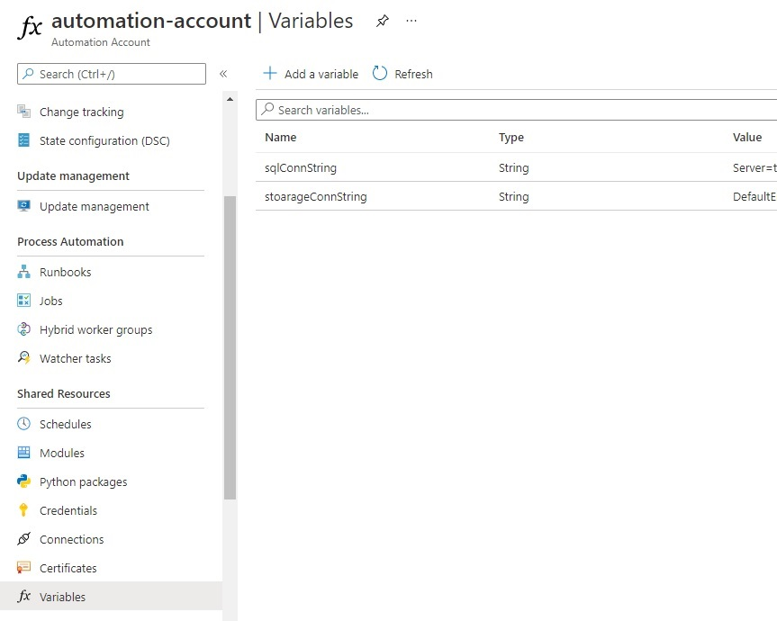

## This runbook shows a sample scenario where you might want to connect to Azure SQL, Azure Table and Azure Blob. 
Similar concept could be applied to connect to other Azure resources. 

### Pre-requisite
1. If you don't already have one, create a Azure SQL Database (ref: https://docs.microsoft.com/en-us/azure/azure-sql/database/single-database-create-quickstart?tabs=azure-portal)

2. Also, create a Storage account for Blob and Table storage, if it is not already available (ref: https://docs.microsoft.com/en-us/azure/storage/common/storage-account-create?tabs=azure-portal)

3. I am creating a sample table in Azure SQL DB with some values in it.

    `create table country
    (
    country_id int IDENTITY(1,1),
    name varchar(30),
    capital varchar(30)
    )`

    Insert some values in this table:

    `insert into country(name, capital)
    values
    ('United States', 'Washington, D.C.'),
    ('France', 'Paris'),

4. Connect to Azure Storage using "Microsoft Azure Storage Explorer" OR using "Azure Portal" and add some related values in the table. I am adding language for each country (PartitionKey="country", RowKey="{country name}}", language="{popular language of the country}")

5. Create a blob container in the storage account.

6. Create Automation account. (Ref: https://docs.microsoft.com/en-us/azure/automation/automation-create-standalone-account)

### Azure Automation setup
1. To connect to Azure resources, we need respective connection strings.

    a. Get connection string of SQL Database (ref: https://docs.microsoft.com/en-us/azure/azure-sql/database/connect-query-content-reference-guide#get-adonet-connection-information-optional---sql-database-only)

    b. Add a new "Variable" in Azure Automation accouint under "Shared Resources" and save the copied "ADO.NET" connection string as its value. You will have to update the password in the connection string. (You may encrypt it for enhanced security)

    c. Follow the step above for Azure Storage Account connection string. 

    

2. If you check the **Modules** section under "Shared Resource", the modules you might need are all here. You can also Add module if not available. 

3. When the AutomationAccount is created, a system assigned managed identity is assigned to it. You can refer to the link below to understand more about managed identities. (ref: https://docs.microsoft.com/en-us/azure/active-directory/managed-identities-azure-resources/overview)

4. This managed identity can be assigned permission to access resources using Azure RBAC (IAM option on respective resource). We could have used the managed identity for the purpose of authentication instead of having username and password in the connection string. However, for the purpose of this simple walkthrough, we are going to use the variables holding connection string, that we created earlier. 

5. For your AzureAutomation runbooks to be able to access these variables, please assign "Contributor" role. You can get details of Roles available for Azure Automation, by going to "Access Control (IAM)" blade in respective automation account --> Roles. 

6. Click on **"+ Add"** button under "Access Control (IAM)" blade --> Add Role Assignment --> select "Contributor" --> Next --> "+ Select identity" --> search for your automation account name -->click select --> Review + Assign. Now, the Automation account's system assigned identity has "Contributor" role for this automation account. 

7. On the SQL Sever created in Azure, go to "Firewall and virtual networks" blade and set "Allow Azure Services and resources to access this server" to Yes. This would ensure that your runbook is able to access the sql server. 

8. **AzTable** module is not available by defaule on Azure Automation account's module. Therefore, please add it by going to "Modules" under Shared resources --> + Add a module --> select "Browse from gallery" --> search for "AzTable" --> select the correct version and import. Please wait for the import to complete (you may seach for AzTable under "Modules" and check for the "Status" column)

9. Use the runbook (`runbook.ps1`) to test out your sample automation runbook which reads information from Azure SQL Server, then queries Azure table storage for related information and finally uploads a txt file which has content read previously. 

